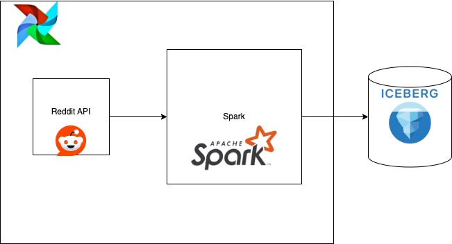
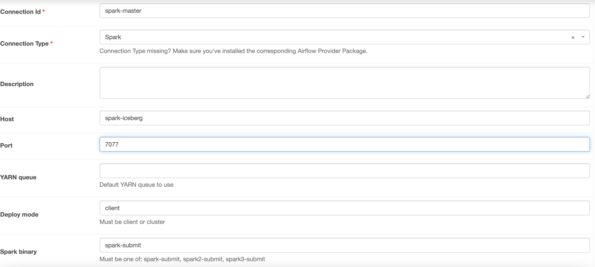

## Reddit Pipeline Using Spark,Iceberg and Airflow


### Architecture Diagram




### Start the Pipeline

- Get the `SECRET` and `CLIENT_ID` by following the instruction [here](https://github.com/reddit-archive/reddit/wiki/OAuth2-Quick-Start-Example#first-steps). Replace the `SECRET` and `CLIENT_ID` environment variable in docker compose for image `x-airflow-common`

- Start the Services

```bash
docker-compose up -d --build
```

- Once the services are up and running. You need to create a spark-connection object on airflow
    - Open up `http://localhost:8080/login/`
    - Type in `admin` as `username` and `password`
    - Go to `http://localhost:8080/connection/add`
    - Make sure your fields are as follow:
    

- Now either trigger the pipeline manually or it will keep running every hour.

- You can go to `http://localhost:8888/notebooks/test.ipynb` and see the `data`.


